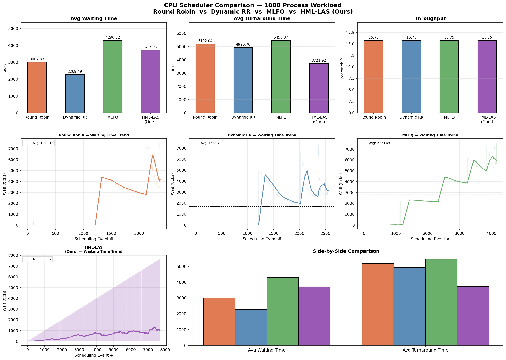

# HML-LAS-CPU-Scheduler

Hybrid ML-Guided Load-Aware Adaptive CPU Scheduler implemented in xv6 RISC-V kernel.

---

## Overview

HML-LAS (Hybrid ML-Guided Load-Aware Scheduler) is an adaptive CPU scheduling algorithm designed for the xv6 RISC-V operating system. The scheduler combines EWMA-based CPU burst prediction with dynamic load-aware scheduling strategies to improve process management efficiency, reduce waiting time, and optimize turnaround performance under high workloads.

This project was developed as part of an Operating Systems academic project and benchmarked against traditional scheduling algorithms such as Round Robin (RR), Dynamic RR, and MLFQ.

---

## Key Features

- Adaptive load-aware scheduling
- EWMA-based CPU burst prediction
- Dynamic priority adjustment
- Reduced starvation probability
- Improved responsiveness under heavy workloads
- Comparative benchmarking with RR, Dynamic RR, and MLFQ
- Multi-process workload simulation and analysis

---

## Tech Stack

| Component | Technology |
|---|---|
| Programming Language | C |
| Operating System | xv6 RISC-V |
| Concepts Used | CPU Scheduling, Operating Systems |
| Scheduling Logic | EWMA + Adaptive Scheduling |

---

## Repository Structure

```bash
Kernel Files/   -> Modified xv6 scheduler source files
Presentation/   -> Project presentation slides
Pseudocode/     -> Scheduling algorithm pseudocode
Report/         -> IEEE-style project report
Results/        -> Benchmark graphs and performance analysis
```

---

## Scheduler Workflow

1. Process enters scheduling queue
2. CPU burst is predicted using EWMA
3. Dynamic priority is assigned
4. Scheduler selects optimal process
5. Execution metrics are updated continuously
6. Load-aware adjustments improve scheduling decisions over time

---

## Performance Results

### Scheduler Performance Comparison



### EWMA Wait Time Analysis


---

## Results Summary

- Lower turnaround time compared to RR and MLFQ
- Improved scheduling adaptability under varying workloads
- Better average waiting time trends during long simulations
- Stable throughput across all scheduling scenarios
- Successfully benchmarked on 1000-process workloads

---

## Future Improvements

- Reinforcement learning based scheduling
- Multi-core CPU scheduling support
- Real-time workload prediction
- Improved kernel instrumentation
- Dynamic quantum optimization

---

## Team Members

- Dev Agarwal
- Kavya Pratap Singh Chauhan
- Keshav Goyal
- Antra Agarwal

---

## License

This project is licensed under the MIT License.